# CAMIR — Cost-Aware Multi-Model Inference Router

CAMIR routes each LLM request to the smallest model tier likely to answer it correctly, on a **self-hosted model pool** a team runs itself — and, before routing anything, measures whether routing is worth doing at all. Its output is not a savings percentage but a reproducible **cost-quality frontier** on the customer's own traffic, against which the engineer who bears the quality risk sets the **quality tolerance**. The claim is deliberately narrow: not *"our router is more accurate"* — the field's own benchmark of 21 methods shows them converged far below the oracle [S4] — but ***your frontier is measurable on your pool, and a meaningful part of the apparent ceiling is your harness*** [S5]. Origin: an SJSU CMPE 295A capstone, September 2026. No revenue, no customer, no pilot, no benchmark run of its own.

**Status:** `COMPLETE` for required artifacts · generated 2026-09-10 · run slug `camir` · **61/61 required artifacts · 45/45 visuals rendered** (browser snapshots of HTML and Mermaid sources — no diffusion model) · website not published, awaiting founder consent

> **[HANDOFF.md](HANDOFF.md) carries the locked decisions** that bind every artifact. **[audit/CRITIC_LOG.md](audit/CRITIC_LOG.md)** records the adversarial review and the cross-document errors it corrected. **[audit/COVERAGE.md](audit/COVERAGE.md)** records row-by-row status and the gates that were run.

---

## Start here

1. **[narrative/one_pager.md](narrative/one_pager.md)** — the claim, the loop, the market, the ask. One page.
2. **[narrative/pitch_deck.md](narrative/pitch_deck.md)** — 14 slides, every title a claim, every slide tied to a visual below.
3. **[tech/whitepaper.md](tech/whitepaper.md)** — the arithmetic: 1.4–1.5× on GPU cost in the base case, and a null result in the conservative case.

## Reading paths by audience

**Investor**
1. [narrative/vc_memo.md](narrative/vc_memo.md) — teardown, three operating examples, the arithmetic and the three risks, in one read.
2. [strategy/market_sizing.md](strategy/market_sizing.md) — why routing fees alone are not venture-scale, stated first.
3. [financials/unit_economics.md](financials/unit_economics.md) — the 42% year-one margin, and the compute line most pitches omit.
4. [financials/use_of_funds.md](financials/use_of_funds.md) — $2.2M in three gates, 87% unspent if the ceiling fails.
5. [financials/comps_exits.md](financials/comps_exits.md) — why TensorZero, not Martian, is the base case.

**Engineer**
1. [product/PRD.md](product/PRD.md) — the loop, *Classify → Dispatch → Judge → Attribute → Recalibrate*, and ten first principles.
2. [tech/architecture/00_INDEX.md](tech/architecture/00_INDEX.md) — ten diagrams, starting with the closed loop.
3. [tech/deep_dives.md](tech/deep_dives.md) — eight algorithms, each with the failure mode that ships silently.
4. [tech/not_vaporware.md](tech/not_vaporware.md) — what is buildable this quarter and what is a research bet.

**Operator**
1. [product/journeys/day_in_life.md](product/journeys/day_in_life.md) — the Tuesday in month four that decides whether a deployment survives.
2. [validation/decision_making_unit.md](validation/decision_making_unit.md) — who signs, who consents, and who can say no alone.
3. [strategy/channel_plan.md](strategy/channel_plan.md) — the one channel whose economics survive, and its unagreed dependency.
4. [validation/stage_gate.md](validation/stage_gate.md) — where the company is, honestly: pre-discovery.

**Practitioner**
1. [product/journeys/edge_low.md](product/journeys/edge_low.md) — one engineer, two GPUs, an afternoon, and nothing to configure.
2. [product/journeys/edge_high.md](product/journeys/edge_high.md) — bring your own judge and five tiers; why not just build it.
3. [product/ux_spec.md](product/ux_spec.md) — why the most important surface is a span attribute in your own tracing tool.
4. [tech/techniques/decision_tree.md](tech/techniques/decision_tree.md) — which of 139 techniques fire, in what order.

**Skeptic**
1. [validation/riskiest_assumptions.md](validation/riskiest_assumptions.md) — ranked, with the harness thesis at rank 1b.
2. [validation/experiment_board.md](validation/experiment_board.md) — every pass/fail line, declared before any result.
3. [research/sources.md](research/sources.md) — 40 sources graded by confidence, and five gaps that could not be filled.
4. [audit/CRITIC_LOG.md](audit/CRITIC_LOG.md) — what the review found, including the errors in this pack.

---

## Full artifact map

Counts from the glob on 2026-09-10.

| Path | What it holds | Files | Owning skill |
|---|---|---|---|
| [`./`](./) | Founder brief, assumptions register, handoff, the task brief used for the handed-off phases, this front door | 5 | grill-me · startup-audit |
| [`research/`](research/) | Landscape, competitor teardown, capability table, survey, 40-source register | 5 | startup-research |
| [`strategy/`](strategy/) | Market type, positioning, sizing, personas, lean and business-model canvases, value proposition, GTM, petal diagram, channel economics, sales roadmap | 11 | startup-strategy |
| [`product/`](product/) | PRD, 20 flagship and 50 prioritised features, UX spec, and [`journeys/`](product/journeys/) (4) | 8 | startup-product |
| [`tech/`](tech/) | Whitepaper, deep dives, not-vaporware; [`architecture/`](tech/architecture/) (11); [`techniques/`](tech/techniques/) (5) | 19 | startup-tech |
| [`validation/`](validation/) | Riskiest assumptions, experiment board, discovery guide, get/keep/grow, stage gate, metrics, pivot log, MVPs, decision-making unit | 9 | startup-validation |
| [`financials/`](financials/) | Pricing, revenue build, unit economics, use of funds, risk matrix, comps and exits | 6 | startup-financials |
| [`narrative/`](narrative/) | One-pager, VC memo, pitch deck, future press release, founder story, mission and values | 6 | startup-narrative |
| [`visuals/`](visuals/) | Manifest, prompts, builders and indexes (7); [`infographics/`](visuals/infographics/) (34 HTML); [`images/`](visuals/images/) (45 PNG) | 86 | startup-visuals |
| [`audit/`](audit/) | Coverage audit and critic log | 2 | startup-audit · startup-critic |

---

## Visual index

Every image is a headless-browser snapshot of an HTML infographic or of a diagram's Mermaid source, so the text in it is the text in the file. The full list, with sources, is in [visuals/visual_manifest.md](visuals/visual_manifest.md).

### The deck set

**V01 — Every request pays for the hardest request's capacity**
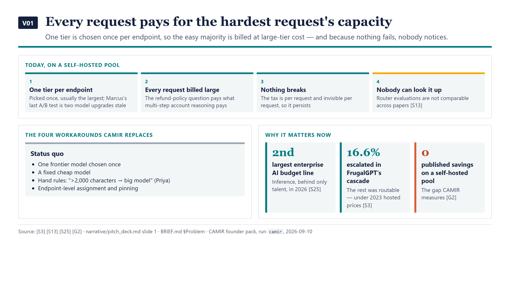

**V02 — Borrowed routing headlines do not transfer to a self-hosted pool**
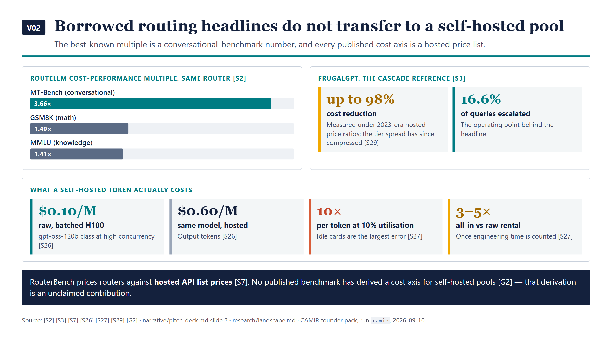

**V03 — Routing accuracy has plateaued, so measurement is the wedge**
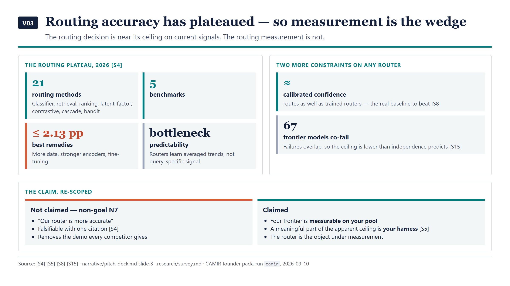

**V04 — A meaningful part of the apparent ceiling is the harness**
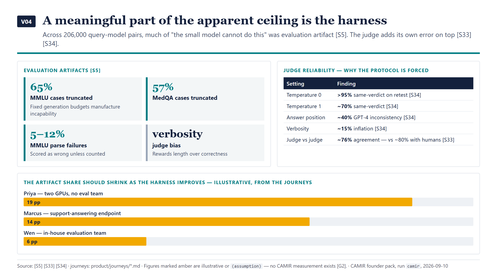

**V05 — The first output can be "do not deploy"**
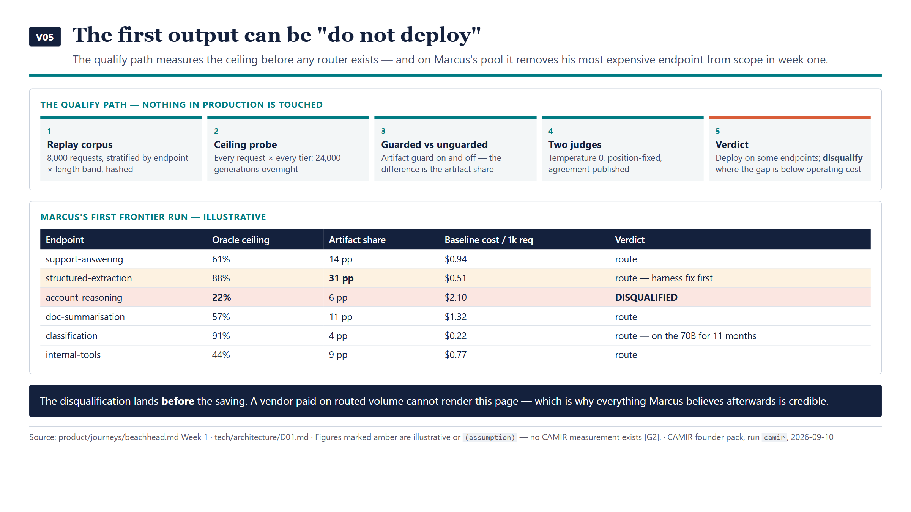

**V06 — The closed loop: Classify → Dispatch → Judge → Attribute → Recalibrate**
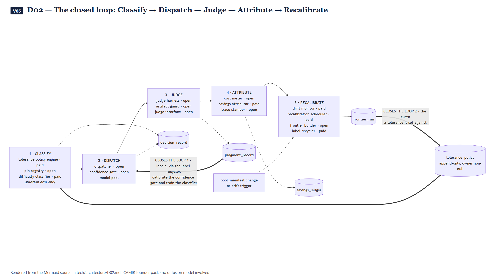

**V07 — The engineer who can veto gets the controls**
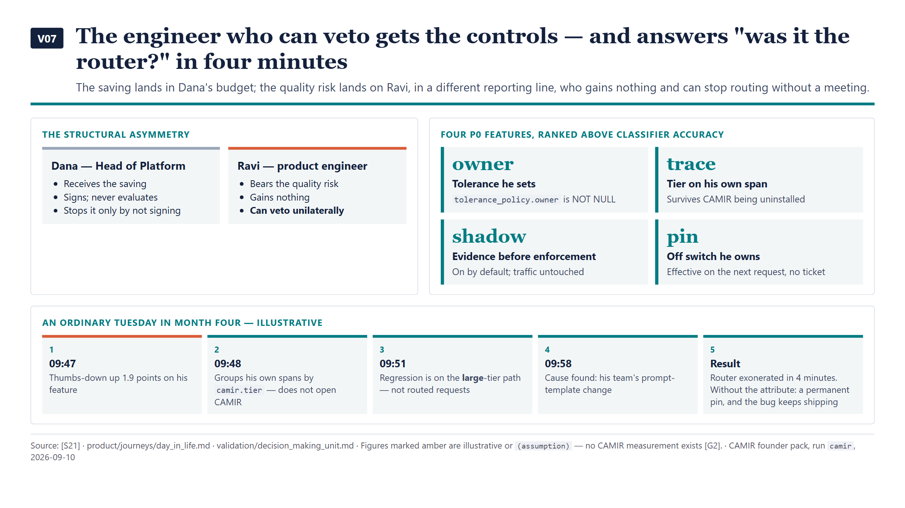

**V08 — Base case 1.4–1.5× on GPU cost; the conservative case is a null result**
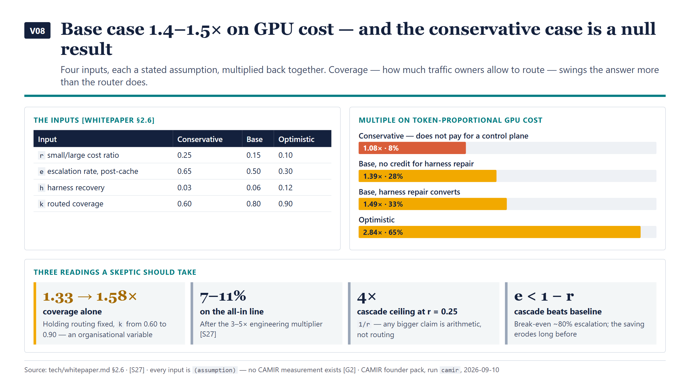

**V09 — $30,000 ACV, priced as a share of a saving the customer computes**
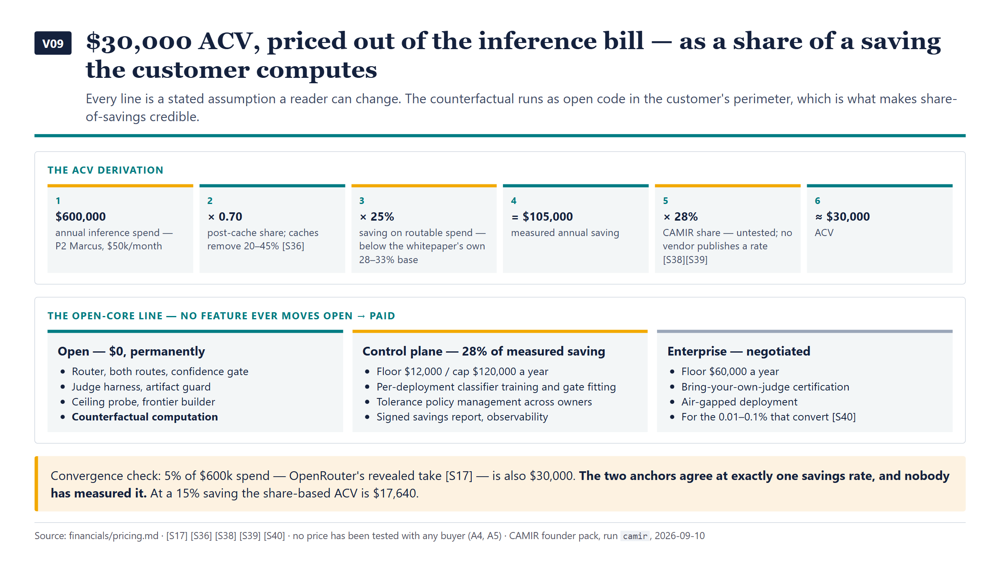

**V10 — Routing fees alone are not venture-scale; the control plane is the option**
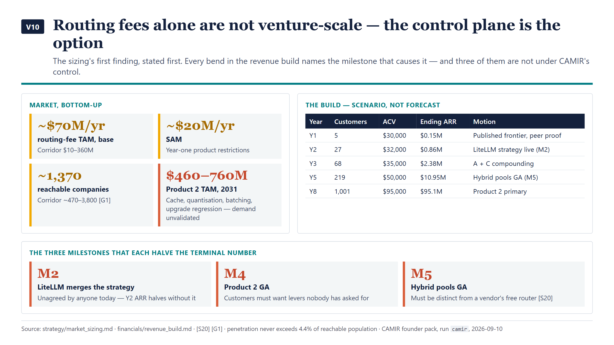

**V11 — One channel's economics survive, and it depends on a maintainer nobody has asked**
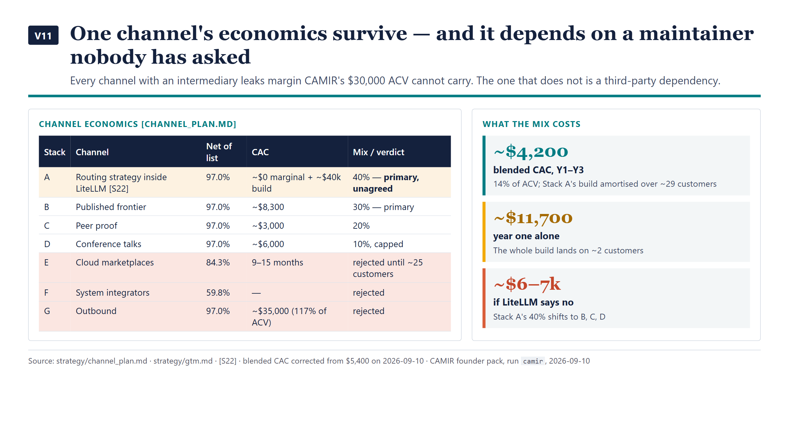

**V12 — Every competitor is paid by the volume it routes**
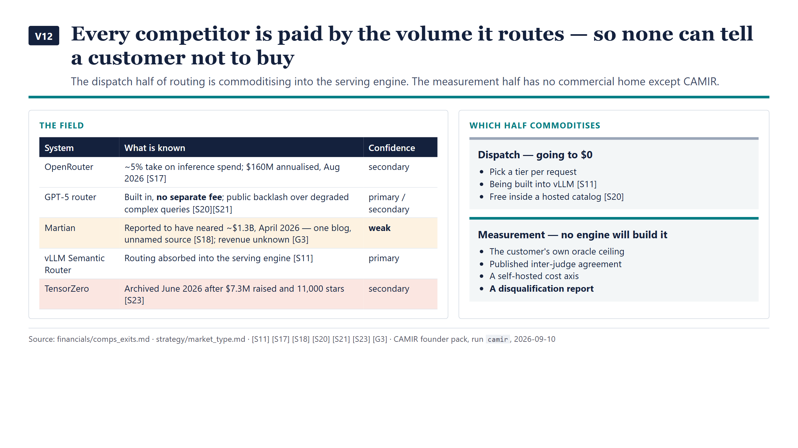

**V13 — The evidence ladder starts with an experiment, not traction**
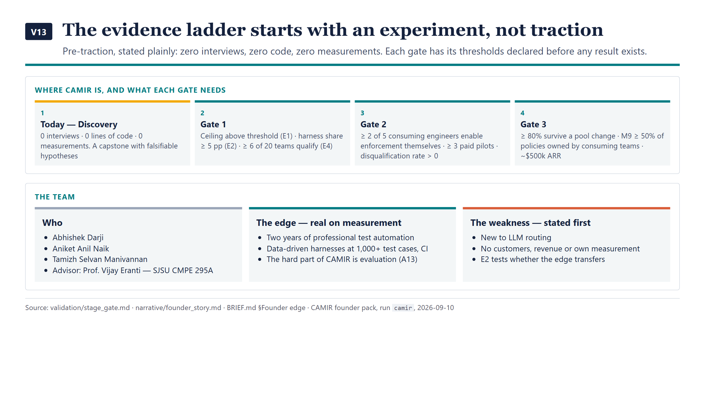

**V14 — $2.2M in three gated blocks, 87% unspent if the ceiling is not there**
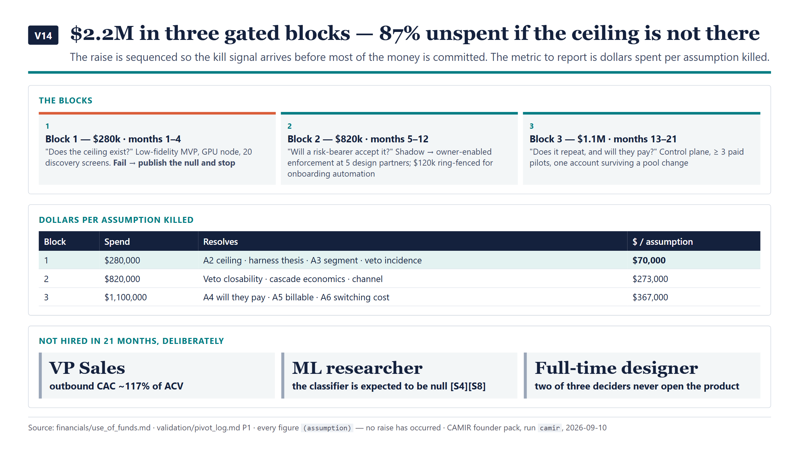

### Everything else

**Product and operations** — [V15 build the four features with no algorithm first](visuals/images/V15_feature-priority.png) · [V17 adoption-deciding features rest on no technique](visuals/images/V17_technique-feature-matrix.png) · [V18 every threshold written before it runs](visuals/images/V18_experiment-gates.png) · [V19 one system across the spectrum](visuals/images/V19_journey-spectrum.png) · [V20 one request, five records](visuals/images/V20_one-request-five-records.png) · [V37 the top surface is a span attribute](visuals/images/V37_ux-surfaces.png) · [V38 buildable now vs research bets](visuals/images/V38_buildable-vs-research.png) · [V39 discovery asks only about the past](visuals/images/V39_discovery-kit.png) · [V40 opened twice a month](visuals/images/V40_get-keep-grow.png)

**Market and money** — [V21 the buyer negotiates the definition](visuals/images/V21_buyer-decision-rights.png) · [V22 two risks stay High](visuals/images/V22_risk-residuals.png) · [V32 the two axes that divide the market](visuals/images/V32_positioning-map.png) · [V33 40 sources, graded](visuals/images/V33_source-register.png) · [V34 two canvases, where each is weakest](visuals/images/V34_two-canvases.png) · [V35 no top fit is a cheaper bill](visuals/images/V35_value-prop-fit.png) · [V36 one petal holds budget](visuals/images/V36_petal-diagram.png) · [V41 the flattering number is the wrong one](visuals/images/V41_metrics-vs-vanity.png) · [V42 year-one margin is 42%](visuals/images/V42_unit-economics-engine.png)

**Narrative** — [V43 the road to 2031](visuals/images/V43_road-to-2031.png) · [V44 five values as trade-offs](visuals/images/V44_mission-values.png) · [V45 what is locked](visuals/images/V45_locked-decisions.png)

**Architecture, rendered from Mermaid** — [D01 qualify pipeline](visuals/images/V23_D01-qualify-pipeline.png) · [D03 request path](visuals/images/V24_D03-request-path.png) · [D04 durable records](visuals/images/V25_D04-durable-records.png) · [D05 cost axis](visuals/images/V26_D05-cost-axis.png) · [D06 perimeter](visuals/images/V27_D06-perimeter.png) · [D07 ecosystem](visuals/images/V28_D07-ecosystem.png) · [D08 observability](visuals/images/V29_D08-observability.png) · [D09 isolation](visuals/images/V30_D09-isolation.png) · [D10 human gates](visuals/images/V31_D10-human-gates.png) · [technique decision tree](visuals/images/V16_technique-decision-tree.png)

---

## Top 5 sharpest claims

1. **The routing decision is near its ceiling; the routing measurement is not.** 21 routing methods across 5 benchmarks converge far below the oracle, and the best remedies bought up to 2.13 points [S4]; meanwhile fixed generation budgets truncated 65% of MMLU and 57% of MedQA cases, with 5–12% parse failures on MMLU [S5]. — [tech/whitepaper.md](tech/whitepaper.md)
2. **The conservative case is a null result, and the pack says so.** Multiplied back together, the four inputs give 1.08× on GPU cost at the conservative end — too little to pay for a control plane — and 1.39–1.49× at base. The largest swing is how much traffic owners allow to route, not the router. — [tech/whitepaper.md](tech/whitepaper.md) §2.6
3. **Every competitor is paid by the volume it routes, so none can tell a customer not to buy.** OpenRouter takes ~5% of the bill it sits on [S17]; a frontier vendor ships routing free with a tolerance the customer cannot set, and the backlash is documented [S20][S21]. CAMIR's first output can be *do not deploy*. — [narrative/vc_memo.md](narrative/vc_memo.md)
4. **Routing fees alone are not a venture-scale business at 2026 denominators.** Base-case routing TAM is ~$70M/yr; the venture case is the inference-efficiency control plane, and its demand is unvalidated. — [strategy/market_sizing.md](strategy/market_sizing.md)
5. **The closest comparable is a shutdown.** TensorZero archived its repository in June 2026 after raising $7.3M and passing 11,000 stars [S23] — the open-core LLM-infrastructure shape CAMIR shares. — [financials/comps_exits.md](financials/comps_exits.md)

---

## Completeness

`COMPLETE` for the 61 required artifacts, verified against [../../references/artifact-manifest.md](../../references/artifact-manifest.md) in [audit/COVERAGE.md](audit/COVERAGE.md), where the gates that were run — link resolution, citation checks, Mermaid parsing, image inspection, a recorded critic pass — are listed with their results. Two things remain outside that count by design: stylised image renders from `visuals/image_prompts.md`, which need a text-to-image tool, and the public website, which waits on the founder's consent because publishing makes the repository public. Completeness here means the pack is finished as an artifact set. **It does not mean anything in it is measured** — the first number that will be CAMIR's own is the oracle ceiling from experiments E1 and E2.
