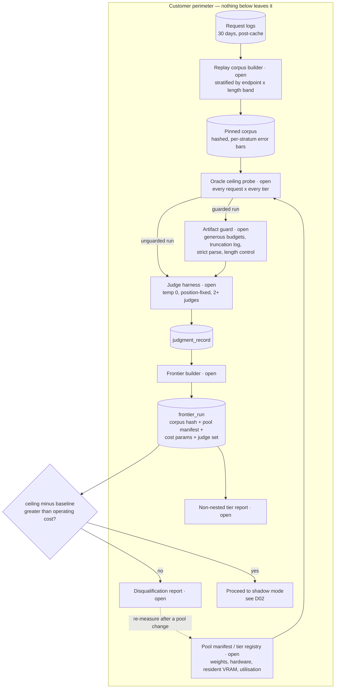

# D01 — The qualify pipeline: production logs to first frontier

**What this is** — the data pipeline that turns a customer's request logs into a measured oracle ceiling, an artifact decomposition and a deploy-or-disqualify verdict, entirely before a router exists.
**Why it exists** — the tempting architecture starts at the ingress proxy, because that is where a router lives. Starting there means the first thing CAMIR can say about a customer is a promise, and the second thing is a bill. This pipeline exists so the first thing CAMIR says is a measurement, including the measurement that ends the deal — and it is the only diagram in the set whose terminal state can be *do not deploy*.
**How to read it** — follow the two ceiling paths out of the probe: guarded and unguarded. Their difference is the pack's technical contribution and nothing else on this page matters as much. A skeptic should attack the corpus node, since everything downstream inherits its representativeness.
**Depends on / feeds** — depends on [../deep_dives.md](../deep_dives.md) DD1 and DD8, [../../product/features_flagship.md](../../product/features_flagship.md) F1–F5; feeds [D02.md](D02.md), [D05.md](D05.md), [../not_vaporware.md](../not_vaporware.md) and [../../product/journeys/edge_low.md](../../product/journeys/edge_low.md).

---

---

## What a reviewer should notice

1. **The ingress proxy is not on this diagram.** No request from a live user is touched anywhere in the pipeline. The customer's first CAMIR output is a number about their own traffic, produced without their production path being modified — which is why Priya can reach a frontier in an afternoon and why the security review for this stage is trivial.
2. **The probe forks into two runs, not one.** Guarded and unguarded ceilings are computed on the same corpus with the same judges. Their difference is the **artifact share** — the portion of "the small tier cannot do this" that was truncation under a fixed generation budget, parse failure or verbosity bias rather than capability [S5]. [S5] found truncation in 65% of MMLU cases and 5–12% parse failures on MMLU alone. **This fork is the whole technical thesis, drawn.**
3. **`DECIDE` is a real branch with a real exit.** The `no` path terminates in a report the customer keeps. A vendor whose revenue is a share of the customer's bill cannot afford to render that page, which is why the disqualification behaviour is a positioning asset rather than a courtesy — see [../../strategy/positioning.md](../../strategy/positioning.md).
4. **The probe cost is `|corpus| × |tiers|` full generations** and is the only step that can break the one-week promise in [../../product/PRD.md](../../product/PRD.md) G1. It is why the pre-flight estimate refuses runs that will not finish inside a stated budget.
5. **The pool manifest feeds the probe, not the router.** Tier cost is declared before any tier is chosen, so the frontier's horizontal axis exists before there is anything to plot on it.
6. **Every node is `open`.** The entire qualify path — the part that produces the number a purchase would rest on — is in the free half, permanently. That is what makes the counterfactual auditable by a party that is not CAMIR (G3, O6), and it is the structural answer to *"every vendor tells me they saved me money."*
7. **The dashed edge out of the disqualification report** is the only loop back. A disqualified customer is not a lost one; they are a customer whose pool has not changed yet [S29].

---

## The data at each stage

| Stage | In | Out | Cost driver |
|---|---|---|---|
| Replay corpus builder | 30 days of logs | ~1,200–8,000 pinned requests | Log parseability, the common real blocker |
| Oracle ceiling probe | corpus × tiers | per-request per-tier answers | **Dominant.** Full generations, linear in both factors |
| Artifact guard | raw generations | truncation flags, parse status, length-controlled text | Marginal |
| Judge harness | answers | `judgment_record` rows | Can exceed generation cost; programmatic verification collapses it where the task admits it |
| Frontier builder | labels + cost params | `frontier_run` | Negligible |

---

## Failure states this diagram must handle

- **A tier OOMs mid-probe** → the run continues with remaining tiers and the `frontier_run` is marked **partial**; an hour of generations is never discarded.
- **One judge unavailable** → single-judge run, and every downstream artifact is stamped *inter-judge agreement unavailable — not reproducible* [S13].
- **Logs carry no outcome signal** → the ceiling is judged rather than observed, which is the judge harness's cost and is stated on the report rather than absorbed.
- **A semantic cache sits upstream** → the corpus is drawn from post-cache traffic, which is adversely selected toward the hard end [S36]. The diagram labels the log source `post-cache` for that reason; the correction is unvalidated [G4].

---

## Recommended next 3

1. **Build this pipeline end to end before writing a line of routing code.** It is the only sequence that produces a negative result cheaply, it makes the one-week promise true in week one, and it yields the artifact decomposition — the pack's contribution — before any routing risk has been taken.
2. **Ship the pre-flight estimator with the probe, not after it.** An unbounded probe is a broken feature, not a slow one: it silently converts Priya's afternoon into a week and turns the qualify path from CAMIR's cheapest asset into its longest sales cycle.
3. **Publish a reference `frontier_run` on public open-weight models and a public corpus.** It costs nothing to disclose, it demonstrates the guarded/unguarded fork on data anyone can re-run, and it is the artifact that makes [../../strategy/gtm.md](../../strategy/gtm.md)'s technical-credibility motion concrete rather than aspirational.
