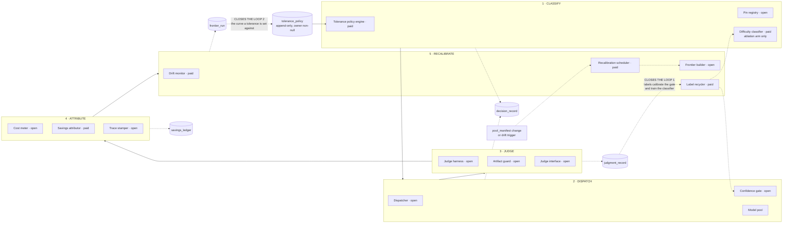

# D02 — The closed loop: Classify → Dispatch → Judge → Attribute → Recalibrate

**What this is** — the product's core cycle drawn as a cycle: the five phases, the components in each, the durable record each phase writes, and the two edges that make it close rather than merely repeat.
**Why it exists** — a router that classifies and dispatches is an open pipeline: it produces decisions and never learns whether they were right. Every commercial routing product in [../../research/competitors.md](../../research/competitors.md) stops there, which is why none of them can tell a customer what their ceiling is or what a decision cost. The two closing edges on this diagram — labels feeding the gate, and the frontier feeding the tolerance the gate reads — are the entire difference between CAMIR and a proxy with a classifier in it, and they are the reason this is a subscription rather than a script.
**How to read it** — trace the two dashed edges out of `judgment_record` and out of `frontier_run` first. Everything else is a pipeline. A skeptic should attack whether the loop compounds: [../../ASSUMPTIONS.md](../../ASSUMPTIONS.md) A6 records that the resulting switching cost is untested, and this diagram does not upgrade it.
**Depends on / feeds** — depends on [../../product/PRD.md](../../product/PRD.md) §1, [../deep_dives.md](../deep_dives.md); feeds [D03.md](D03.md), [D04.md](D04.md), [D08.md](D08.md), [../techniques/decision_tree.md](../techniques/decision_tree.md) and [../../narrative/pitch_deck.md](../../narrative/pitch_deck.md).

---

---

## What a reviewer should notice

1. **Two edges close the loop, and they close it in different currencies.** Loop 1 is *labels*: `judgment_record` rows become the gate's calibration set and the classifier's training set. Loop 2 is *policy*: a `frontier_run` is the curve a human sets a tolerance against, and when the curve moves the policy is re-examined rather than silently re-fitted. A system with only loop 1 learns and cannot be governed; a system with only loop 2 is a consulting engagement.
2. **The loop closes per deployment, never network-wide.** CAMIR cannot pool labels across customers without moving prompt-derived data out of the perimeter, which N4 forbids. This costs the classic data-network-effect story and is stated plainly in [../../product/PRD.md](../../product/PRD.md) §6 rather than elided. What a funded copycat lacks after two years is the accumulated per-customer routing history — not the algorithm.
3. **The difficulty classifier is labelled *ablation arm only*.** It is inside CLASSIFY because it belongs to the phase, not because it is the primary path. The cascade route through `DISPATCH → GATE` is primary (PR3, [S8]), and the classifier is reported against calibrated confidence rather than against a fixed model.
4. **`tolerance_policy` is drawn as append-only with a non-null owner.** It is the only record on the diagram with a constraint written on its face, because Dana's "who checked that nothing got worse, in writing" is a schema constraint (O3), not a report section — and because a router that can re-fit under a signed policy has broken the promise that got it past Ravi.
5. **The open/paid split runs *through* every phase, not between them.** No phase is wholly paid. That is what makes the free half a complete, useful system rather than a demo: an open-source user gets the entire measurement loop, and what they lack is per-deployment fitting, policy management across owners and attribution they can defend in a budget review. No feature ever moves open → paid [S23].
6. **RECALIBRATE has an external trigger.** A `pool_manifest` change fires a re-run unconditionally, because a model upgrade invalidates the frontier by definition [S29]. The loop is not on a timer; it is on an event.
7. **The judge interface sits inside JUDGE as a peer of the harness.** Wen replaces the judge and keeps everything else; CAMIR's code still computes her agreement statistic. If that node were absent the edge-high segment would be unaddressable.

---

## Per phase: component, record, and the metric it moves

| Phase | Primary component | Writes | Metric ([../../product/PRD.md](../../product/PRD.md) §8) |
|---|---|---|---|
| Classify | tolerance policy engine, pin registry | `decision_record` opened | M8 endpoints under policy · M9 owner is the consuming team |
| Dispatch | dispatcher, confidence gate | `decision_record` completed | **M6 escalation rate** — the variable that sets cascade economics (PR1) |
| Judge | judge harness, artifact guard | `judgment_record` | M3 artifact share · M5 inter-judge agreement |
| Attribute | cost meter, savings attributor, trace stamper | `savings_ledger`, caller's spans | M4 cost per request · M13 question-to-answer under an hour |
| Recalibrate | drift monitor, scheduler, frontier builder | `frontier_run` | M12 recalibrations per quarter · M1 ceiling |

---

## The loop's honest limits

- **Loop 1 needs labels, and labels cost money.** Production judging is sampled, not exhaustive, so the calibration set grows slower than traffic. The drift monitor therefore runs on label-free signals — escalation rate and calibration error — with quality confirmed on a sample.
- **Loop 2 needs a human.** A frontier that moves does not change a policy on its own. That is deliberate and it is a cost: an unattended deployment drifts toward a stale tolerance until someone reads a diff.
- **Neither loop makes the classifier good.** [S4] finds 21 routing methods converged in a narrow band far below the oracle from a predictability bottleneck, with remedies worth up to 2.13 percentage points. More labels do not escape that; the only credible escape is a different signal class — prefill activations [S10] — and it is unproven.

---

## Recommended next 3

1. **Implement the Attribute phase before the Classify phase.** Attribution is what makes a routing decision defensible, and a deployment that routes before it can attribute is one quality question away from being pinned to large forever ([../../product/journeys/day_in_life.md](../../product/journeys/day_in_life.md), 09:47). Classification is the phase whose value the literature is least sure of.
2. **Make loop 2's re-examination an explicit, notified event in the first release.** Owners whose tolerance point moved must be told individually. The alternative — a router that quietly re-fits under a policy someone signed — is indistinguishable from the vendor-set tolerance that produced the public GPT-5 routing backlash [S21].
3. **Instrument the label-growth rate as a product metric.** Loop 1's compounding is the entire moat claim and it is currently an assumption (A6). Knowing how many labelled requests a real deployment accumulates per month is the cheapest test of whether switching cost rises at all, and it can be measured on the first design partner.
