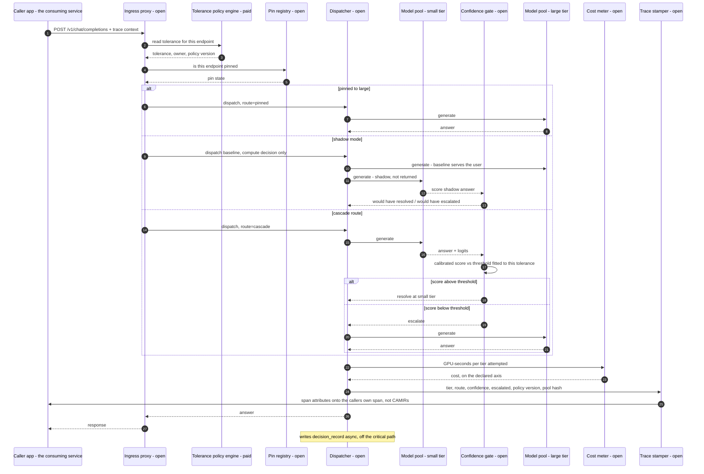

# D03 — Request path orchestration: what fires, in what order, on one live request

**What this is** — the sequence of component calls on a single production request through the cascade route, including the escalation branch, the shadow branch and the pin branch, with the durable writes marked.
**Why it exists** — the ordering on this page is a product commitment, not an implementation detail. If the pin is read after tier selection, a pin takes effect "eventually" and Ravi's off switch becomes a request. If the tolerance is read after dispatch, the policy is documentation. If the trace stamp happens only on CAMIR's own span, the person who can veto the deployment cannot answer his own question. Each of those is a plausible engineering shortcut that silently converts CAMIR into the product that got pinned to large in month four, and none of them can be retrofitted after a deployment has been pinned.
**How to read it** — read the first three messages, then the `alt` block. The first three are the ones that cannot be reordered. A skeptic should attack the latency budget table: the gate is on the critical path of every request that resolves at the small tier.
**Depends on / feeds** — depends on [D02.md](D02.md), [../deep_dives.md](../deep_dives.md) DD2, [../../product/ux_spec.md](../../product/ux_spec.md) S9; feeds [D08.md](D08.md), [D09.md](D09.md), [../not_vaporware.md](../not_vaporware.md) and [../../product/journeys/beachhead.md](../../product/journeys/beachhead.md).

---

---

## What a reviewer should notice

1. **Messages 2–5 happen before any model is chosen.** Tolerance and pin are read first, unconditionally, on every request. A pin is therefore effective on the *next* request with no propagation delay and no ticket — which is what makes it an off switch Ravi owns rather than an escalation he files ([../../product/ux_spec.md](../../product/ux_spec.md) S10).
2. **Shadow mode generates twice and returns the baseline.** It costs real money — the small-tier generation is thrown away — and that cost is the price of the evidence that unblocks the beachhead deal. Shadow is on by default for new endpoints and must be actively disabled; nobody in any journey chose it.
3. **The trace stamp goes to the caller's span, not to CAMIR's store.** That message crosses back into the application's own telemetry. This is the single most consequential arrow in the architecture: it is what let Ravi exonerate the router in four minutes from his own tooling, and it survives CAMIR being uninstalled (O2).
4. **The confidence gate is on the critical path of every cascade request that resolves cheaply.** Its own latency is paid on the *saving* path, which is the wrong direction. A gate that needs k samples for self-consistency scoring pays k generations before saving one — which is why the default estimator is length-normalised sequence log-likelihood, already available from the small tier's own output at no extra generation.
5. **`decision_record` is written asynchronously.** The durable record is never on the request's critical path; a record store outage degrades attribution, never availability.
6. **The escalation branch pays twice.** Failed small attempt + gate + large answer. That decomposition is shown to the operator before enforcement (PR1), because a cascade with a high escalation rate is a *more expensive* way to serve identical traffic and no dashboard reporting only "savings" would reveal it.
7. **There is no `classifier route` branch on this diagram** — deliberately. It exists, and it is drawn in [../techniques/decision_tree.md](../techniques/decision_tree.md) as the ablation arm. Putting it here as a peer of the cascade would misrepresent which path is primary.

---

## Latency budget on the cascade route

| Step | Added latency | Notes |
|---|---|---|
| Tolerance + pin read | sub-millisecond | In-process cache, invalidated on policy write |
| Small-tier generation | the dominant term | Would not have been paid on the baseline path |
| Confidence gate scoring | ~1–5 ms for log-likelihood-based scores | Rises sharply for sampling-based estimators |
| Escalation, when it happens | full large-tier generation | The escalated request is **slower than baseline**, always |
| Cost meter + trace stamp | sub-millisecond, async where possible | — |

**The honest statement:** on the ~24% of requests that escalate ([../../product/journeys/beachhead.md](../../product/journeys/beachhead.md)), CAMIR makes latency *worse* than the fixed-model baseline. CAMIR reports latency and does not promise it — non-goal N6, and [S12] establishes latency as a genuine third axis that would triple the frontier's dimensionality before the two-dimensional one has been measured once.

---

## Failure behaviour on the request path

| Failure | Behaviour | Why |
|---|---|---|
| Control plane unreachable | **Fail open to the baseline tier**, stamp `route=fallback` | CAMIR must never be on the customer's uptime critical path (N2) |
| Policy store unreachable | Last-known tolerance from the in-process cache; alert | A stale conservative tolerance is safe; no tolerance is not |
| Gate cannot score | Escalate | The safe direction is expensive, not risky |
| Small tier unavailable | Dispatch to the next tier up, stamp the substitution | — |
| Trace context absent | Stamp CAMIR's own span and flag the endpoint as **unattributable** on the tolerance panel | An endpoint that cannot be attributed should not be enforced |

---

## Recommended next 3

1. **Fix the message ordering in a conformance test before the first release.** Tolerance and pin before tier selection is the ordering that cannot be retrofitted, and it is the ordering an optimisation pass will break first — reading the pin lazily is an obvious latency win and a product-fatal one.
2. **Default the confidence gate to an estimator that needs no extra generation.** The gate is on the critical path of exactly the requests CAMIR is meant to make cheaper; a sampling-based scorer can spend the saving before it is realised. Sampling estimators belong behind an explicit opt-in with their cost shown.
3. **Make `route=fallback` a first-class value that appears on the live view.** A CAMIR outage that silently serves baseline traffic looks identical to a CAMIR that is working and finding nothing to route — and the two have opposite implications for renewal.
