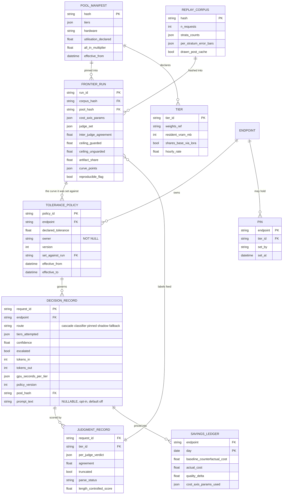

# D04 — Durable records: the schema the product's promises are made of

**What this is** — the entity model behind CAMIR's six durable records, their keys, the constraints written into them, and what each one makes possible that a report alone could not.
**Why it exists** — three of CAMIR's most-repeated promises are schema facts or they are marketing. *"Who checked that nothing got worse, in writing"* is `tolerance_policy.owner NOT NULL` or it is a paragraph someone can omit. *"Reproducible by a stranger"* is `frontier_run` pinning corpus hash, pool manifest, cost parameters and judge set, or it is a claim [S13] specifically complains about. *"Your prompts never leave"* is `decision_record.prompt_text` being nullable, opt-in and default-off, or it is a policy that erodes the first time a support engineer needs to debug something. This diagram is where those three stop being promises.
**How to read it** — look for the constraints written on the entities, not the entities. A skeptic should attack retention: `savings_ledger` and `tolerance_policy` are permanent, and permanence is a liability as well as an asset.
**Depends on / feeds** — depends on [../../product/PRD.md](../../product/PRD.md) §6–§7, [D02.md](D02.md); feeds [D06.md](D06.md), [D08.md](D08.md), [D09.md](D09.md) and [../deep_dives.md](../deep_dives.md) DD6.

---

---

## What a reviewer should notice

1. **`tolerance_policy.owner` is annotated `NOT NULL` on the schema.** Enforcement is impossible for an endpoint with no named owner — the constraint is in the database, so the savings report *cannot render* without the "who checked" field (O3). This is the single cheapest structural answer to the payer-is-not-the-user problem in [../../strategy/personas.md](../../strategy/personas.md).
2. **`decision_record.prompt_text` is nullable, opt-in and default off.** Everything CAMIR needs — routing, calibration, attribution, drift — works with it null. That is what makes P1 addressable at all, since she self-hosts for data residency rather than price [S28] (O1).
3. **`frontier_run` carries five provenance columns.** Corpus hash, pool hash, cost-axis parameters, judge set and inter-judge agreement. `reproducible_flag` is computed, not asserted: a run with a single judge or a missing agreement statistic is flagged **not reproducible** and every artifact derived from it inherits the flag [S13].
4. **`tolerance_policy` points back at the `frontier_run` it was set against.** That FK is what makes the frontier diff possible — "did my point move?" is answerable because the policy remembers which curve it was chosen on. Without it, a pool upgrade silently invalidates every signed policy and nobody can tell.
5. **`tier.shares_base_via_lora` exists as its own column.** Multi-LoRA adapters share a base model at megabytes each [S31]; distinct base models do not. Conflating the two is the most common way a tier registry lies about resident cost, and it is invisible in a three-tier deployment and load-bearing in Wen's five-tier one.
6. **`savings_ledger` stores the cost parameters it was computed with.** A ledger row priced at 25% utilisation is not comparable to one priced at 60%, so the parameters travel with the row rather than living in a config file that changes underneath it.
7. **`decision_record.route` includes `fallback`.** A CAMIR outage that serves baseline traffic is recorded as such, so it can never be counted as a routing decision that happened to choose the large tier.

---

## Retention and volume

| Record | Retention | Volume, at Marcus's ~$50k/mo | Why this retention |
|---|---|---|---|
| `decision_record` | Customer-controlled, default 90 days | ~5M rows/month | Operational; the value is in the aggregates, and long retention is a liability with no matching asset |
| `judgment_record` | Run-scoped, plus sampled production | ~50k/month sampled | The classifier's training set and the gate's calibration set — the loop-1 asset |
| `savings_ledger` | **Permanent** | ~180 rows/month | It is the audit trail behind a number in a budget review; deleting it deletes the defence |
| `tolerance_policy` | **Permanent, append-only** | tens of rows | Deleting a superseded policy destroys the record of who accepted what risk, when |
| `frontier_run` | **Permanent** | ~4/quarter | Reproducibility means old runs stay comparable |
| `pool_manifest` | Versioned, permanent | on change | A frontier is meaningless without the pool it was measured on |

**The liability side, stated.** Permanent records naming individuals as risk-acceptors are a discovery surface. `tolerance_policy.owner` should hold a role-and-person reference the customer controls, and the customer's own retention policy governs — CAMIR provides the constraint, not the copy of record.

---

## What is deliberately not a record

- **No prompt corpus by default.** N4 and O1.
- **No cross-customer table of any kind.** The loop closes per deployment ([D02.md](D02.md)); there is no schema in which two customers' rows coexist, which is why the network-effect story is absent from [../../product/PRD.md](../../product/PRD.md) §6.
- **No answer text in `judgment_record`** beyond what the judge needed; scores and flags persist, generations do not, unless the customer opts in for debugging.

---

## Recommended next 3

1. **Write the `NOT NULL` on `owner` in the first migration, not the first release.** Adding it later means backfilling a name onto policies nobody remembers setting, and the usual resolution is a service account — which converts the product's strongest organisational answer into a null value wearing a username.
2. **Ship `reproducible_flag` as a computed column with the derivation documented.** It is the mechanism that stops a degraded run quietly becoming a quoted number, and it is the thing Wen checks before she believes any frontier ([../../product/journeys/edge_high.md](../../product/journeys/edge_high.md)).
3. **Publish the schema itself in the open half.** A customer able to re-derive the counterfactual (G3) needs the record layout as much as the code; publishing it also makes CAMIR's records exportable, which lowers the perceived lock-in that would otherwise stall the security review in [D06.md](D06.md).
