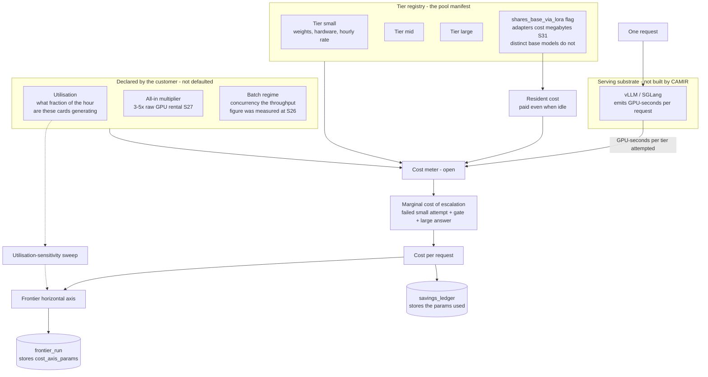

# D05 — Model pool, tier registry and cost metering: where the number on the horizontal axis comes from

**What this is** — the path from a GPU-second to a per-request cost: how tiers are declared, how resident and marginal cost are separated, which parameters are customer-declared rather than assumed, and how the same derivation prices both the frontier and the live savings ledger.
**Why it exists** — every routing benchmark in the literature prices against **hosted API list prices**, RouterBench included [S7]. A self-hosted pool has no list price; it has amortised GPU-hours, a utilisation figure, and an all-in multiplier for the engineering nobody counts. Deriving that axis is the unclaimed contribution [G2] identifies by its absence, and getting it wrong is the fastest way to quote a saving that is 3–5× too large [S27] — the exact error a customer like Marcus catches in the first meeting, after which nothing else in the pack is believed.
**How to read it** — follow the three declared parameters in the yellow path: utilisation, all-in multiplier, batch regime. Those three move the answer more than any routing improvement will. A skeptic should re-derive the arithmetic in the worked example by hand.
**Depends on / feeds** — depends on [../deep_dives.md](../deep_dives.md) DD4, [../../product/features_flagship.md](../../product/features_flagship.md) F3; feeds [D01.md](D01.md), [D07.md](D07.md), [../../financials/unit_economics.md](../../financials/unit_economics.md) and [../whitepaper.md](../whitepaper.md) §4.1.

---



---

## What a reviewer should notice

1. **Three parameters are declared by the customer and none of them has a silent default.** CAMIR asks. A defaulted utilisation figure is the single largest error source in the whole system: a card idle at 10% utilisation costs **10× per token** [S27], which dwarfs any routing improvement anyone has ever published.
2. **Resident cost and marginal cost are separate paths.** A tier that must stay resident costs money while idle; a tier reached only on escalation costs its generation plus the failed small attempt. Collapsing the two — the natural implementation — makes a three-tier pool look free to widen and is why naive pools can cost *more* than a single model.
3. **CAMIR does not serve models.** vLLM/SGLang is drawn as an external box that CAMIR reads GPU-seconds from. This is non-goal N2 and it is the boundary that keeps CAMIR off the customer's uptime critical path; it is also where [S11]'s commoditisation threat enters, and [D07.md](D07.md) draws that explicitly rather than hiding it.
4. **The sensitivity sweep is a dashed edge into the axis, not a report.** The frontier is rendered *with the cost parameters editable in place* ([../../product/ux_spec.md](../../product/ux_spec.md) S2), so Marcus can push the multiplier to 5× and watch the saving shrink. A number that survives the customer pushing it pessimistically is a different kind of number.
5. **Both consumers of cost read the same meter.** The frontier's axis and the live `savings_ledger` come from one derivation, so the curve a tolerance was chosen on and the bill it produced are denominated identically. Two cost paths would let the demo and the invoice diverge — which is the incumbent failure mode this whole architecture is arguing against [S17].
6. **`cost_axis_params` is stored on both the `frontier_run` and every ledger row.** Parameters travel with the data. A frontier priced at 25% utilisation is never silently compared with one priced at 60%.

---

## The derivation, worked

```
cost_per_request = Σ over tiers attempted:
      gpu_seconds(tier) × hourly_rate(tier) ÷ 3600
    ÷ utilisation_declared
    × all_in_multiplier
    + amortised_resident_cost(tier) × request_share
```

**Worked, on a two-tier cascade** `(assumption: illustrative; rates from [S26][S27], no CAMIR measurement exists)`

| | Small tier | Large tier |
|---|---|---|
| GPU-seconds for this request | 0.8 | 4.1 |
| Hourly rate | $2.50 | $2.50 |
| Raw cost | $0.00056 | $0.00285 |
| ÷ utilisation 0.41 | $0.00136 | $0.00695 |
| × all-in 4× | $0.00544 | $0.02780 |

- **Resolved at small tier:** $0.0054
- **Escalated:** $0.0054 + $0.0278 = **$0.0332** — *more than the baseline's $0.0278*
- **At a 24% escalation rate:** 0.76 × 0.0054 + 0.24 × 0.0332 = **$0.0121** vs baseline $0.0278 → **56% saving on token-proportional GPU cost**

**Break-even escalation rate:** the cascade costs more than baseline above `1 − (small ÷ large)` ≈ **80%** in this example — but the *saving* collapses long before that, which is why escalation rate is the operator-facing control variable (PR1) and why the break-even line is drawn on the live view.

---

## Where this derivation can lie

| Failure | Effect on the number | Guard |
|---|---|---|
| Utilisation assumed rather than measured | Up to 10× error [S27] | Required field; measured from the serving stack where it exposes it |
| All-in multiplier omitted | 3–5× overstatement [S27] | Required, non-defaulted, and shown on the report face |
| Batch regime unstated | ~$0.10/M tokens assumes high concurrency [S26]; a low-concurrency pool is far worse | Recorded on the manifest; the frontier states it |
| Resident cost of a widened pool ignored | A third tier looks free | `shares_base_via_lora` distinguishes adapters from base models [S31] |
| **Saving quoted against the all-in inference line** | Overstatement, because the saving is on token-proportional GPU cost only | [../whitepaper.md](../whitepaper.md) §4.1 makes this an explicit renunciation |
| Tier spread compresses | The whole saving shrinks | [S29]: a 31B-class model now sits within ~10 Elo points of far larger open-weight models — this compresses **against** CAMIR and is on the risk matrix |

---

## Recommended next 3

1. **Publish the derivation as a standalone public document before the first `frontier_run` ships.** It is an unclaimed contribution [S7], it is what makes CAMIR's curves comparable to anyone else's, and a frontier with an undeclared cost axis reproduces exactly the incomparability [S13] complains of.
2. **Measure utilisation from the serving stack rather than asking, wherever vLLM or SGLang exposes it.** The asked figure is the largest error source and the one a customer is least equipped to answer accurately; asking should be the fallback, with the measured value shown beside the declared one.
3. **Put the break-even escalation rate on the live routing view as a drawn line, not a number in a doc.** PR1 says first-stage resolution sets cascade economics; an operator who cannot see how close they are to the inversion point will discover it on an invoice.
