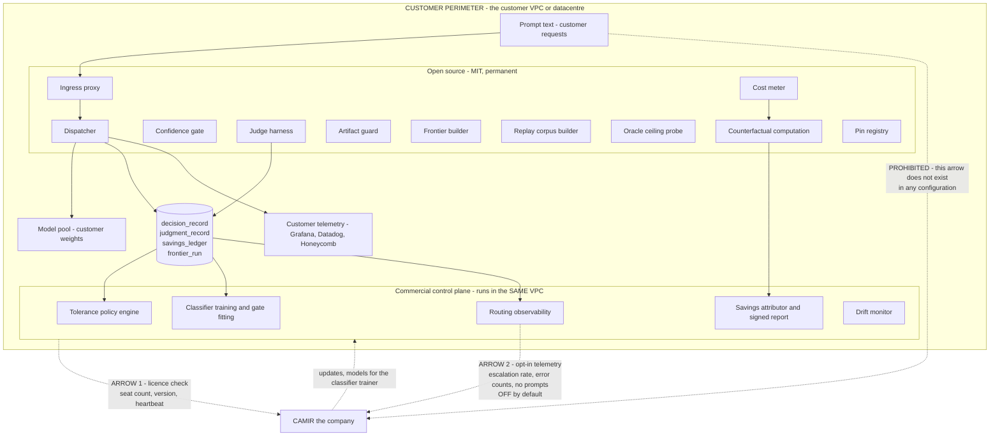

# D06 — Perimeter, privacy and the open/paid boundary: which arrows cross what

**What this is** — the trust-boundary diagram: what runs inside the customer's network, what CAMIR the company can ever see, and where the open-source half ends and the commercial control plane begins — drawn as one picture because for CAMIR the two boundaries are load-bearing for the same reason.
**Why it exists** — CAMIR's beachhead self-hosts for **data residency, not price** [S28]. A control plane that reads prompts disqualifies P1 outright, no matter how good the routing is. Separately, Marcus's objection — *"every vendor tells me they saved me money; they're also the ones doing the math"* — is unanswerable by methodology and is answered only by the counterfactual being computed by open code inside his perimeter. Both objections are killed or survived by which side of a line a component sits on, and a security reviewer who has to ask has already priced the risk higher than this diagram would have.
**How to read it** — count the arrows leaving the perimeter. There are two, and both carry metadata. A skeptic should attack the metadata claim: aggregate routing statistics are not nothing, and the diagram says what they are.
**Depends on / feeds** — depends on [../../product/PRD.md](../../product/PRD.md) §7, [D04.md](D04.md); feeds [D07.md](D07.md), [D09.md](D09.md), [../../strategy/market_type.md](../../strategy/market_type.md) and [../../financials/risk_matrix.md](../../financials/risk_matrix.md).

---

---

## What a reviewer should notice

1. **Two arrows leave the perimeter and neither carries a prompt.** Arrow 1 is a licence heartbeat. Arrow 2 is opt-in operational telemetry — escalation rates, error counts, version — and it is **off by default**. The edge from `Prompt text` to `CAMIR the company` is drawn and labelled PROHIBITED rather than omitted, because a diagram that merely omits an arrow is not a commitment.
2. **The commercial control plane runs in the customer's VPC, not in CAMIR's cloud.** That is non-goal N4 and it is what makes this diagram different from every SaaS routing product in [../../research/competitors.md](../../research/competitors.md). It costs CAMIR the operational leverage of multi-tenancy and it is the price of the beachhead existing.
3. **The counterfactual computation is in the open half.** This is the diagram's most commercially expensive decision: the number a purchase rests on is computed by code CAMIR does not control, on the customer's hardware, from records the customer holds (G3, O6). CAMIR can be uninstalled and the savings history remains re-derivable. Every alternative places the vendor in the position [S17] and [S20] describe, where the party billing you is the party computing the bill.
4. **The entire qualify path is open.** Corpus builder, ceiling probe, artifact guard, judge harness, frontier builder. The measurement that could end the deal is free, permanently — which is what makes the disqualification report credible rather than a sales device.
5. **The paid half is genuinely a different kind of thing, not withheld features.** Per-deployment fitting, policy management across owners, attribution and observability. **No feature ever moves open → paid.** [S23] is the post-mortem for what happens when that line is not drawn from the start: TensorZero archived its repository in June 2026 after raising $7.3M and passing 11,000 stars, citing the difficulty of finding fit for an open project and a commercial product simultaneously.
6. **The dispatcher writes into the customer's own telemetry**, which is an arrow that stays inside the perimeter and outlives CAMIR entirely (O2).
7. **The classifier consumes derived features only** (O8). No feature may be free text, and the feature list is inspectable — so even the paid trainer never needs prompt text.

---

## What CAMIR the company can and cannot know

| | Can | Cannot |
|---|---|---|
| Prompts and answers | — | **Never**, under any configuration |
| Which endpoints exist | Only via opt-in telemetry, as opaque ids | Their content, purpose or traffic |
| Measured savings | Only what the customer chooses to share | Read a customer's `savings_ledger` |
| Frontier shape | Only from a published reference run | Aggregate across customers |
| Whether a deployment is failing | Escalation rate and error counts, if telemetry is on | Anything, if it is off |

**The honest cost of this design, stated:** CAMIR has poor visibility into its own product's health in the field, cannot build a cross-customer benchmark, and cannot pool labels — which is why the compounding claim in [../../product/PRD.md](../../product/PRD.md) §6 is per-deployment and why the network-effect story is absent from this pack. A funded competitor willing to run multi-tenant will learn faster. That trade is deliberate and it is on the risk matrix.

---

## The open/paid line, in one table

| Component | Side | The test applied |
|---|---|---|
| Ingress proxy, dispatcher, confidence gate, both routes | **open** | It is on the request path; a closed request path is unauditable |
| Judge harness, artifact guard, frontier builder, ceiling probe, corpus builder | **open** | It produces the number a purchase rests on |
| Cost meter and counterfactual computation | **open** | The vendor must not be the only party who can compute the bill |
| Classifier training, gate fitting | paid | Per-deployment work, recurring, and worthless without the customer's own labels |
| Tolerance policy management across endpoints and owners | paid | Organisational, not algorithmic — the thing a single engineer does not need and a platform team cannot do without |
| Savings attribution and the signed report | paid | The artifact Dana signs; the *computation* underneath it is open |
| Routing observability | paid | Operational surface, replaceable by the customer's own tooling if they prefer |

---

## Recommended next 3

1. **Publish this diagram and the licence commitment before the first release, not with it.** Open-core credibility is spent once. P6 Sam is the distribution channel and a single relicensing ends that — the commitment has to be public before anyone has a reason to doubt it.
2. **Make arrow 2 opt-in with a visible, per-field disclosure of exactly what is sent.** Telemetry that is on by default converts a residency-driven buyer's security review from a formality into a blocker, and P1's contract is the reason she is self-hosting at all [S28].
3. **Get this reviewed by an actual enterprise security team before a design partner does it under time pressure.** The perimeter answer is the gate on whether CAMIR is usable by its own beachhead; discovering a flaw in it during a partner's review costs the partner, not just the design.
