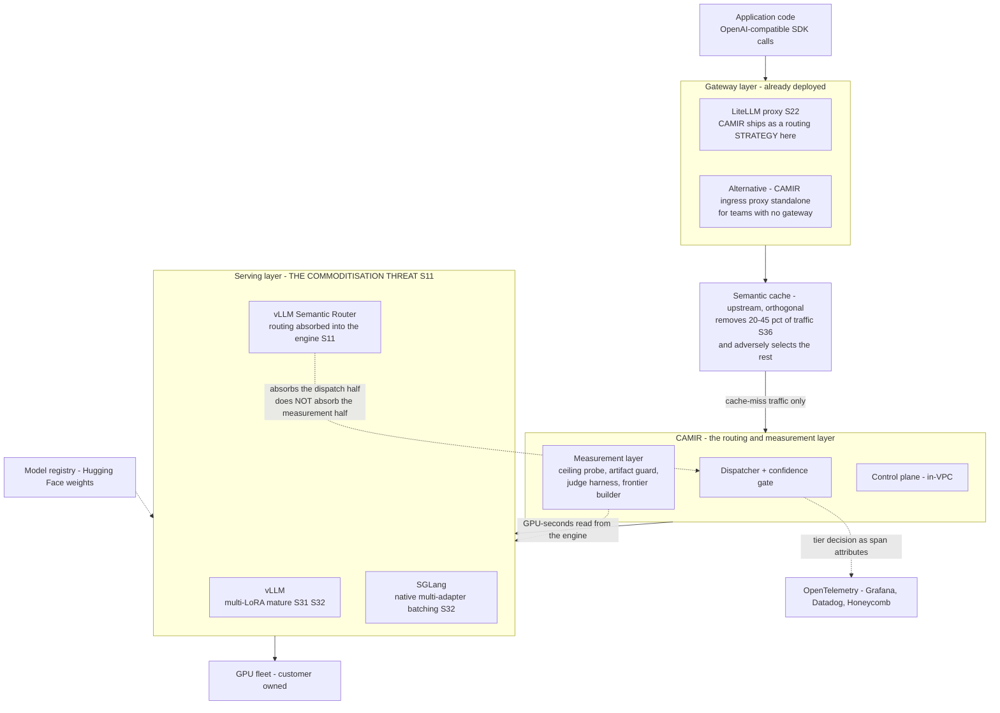

# D07 — Integrations and ecosystem: where CAMIR sits in a stack that already exists

**What this is** — the layer diagram of the stack around CAMIR: the gateway above it, the serving engines below it, the cache upstream, the telemetry sideways — and the explicit marking of which of those neighbours is also the thing most likely to absorb CAMIR entirely.
**Why it exists** — nothing in this stack is missing. There is already a proxy layer, already a serving layer, already a cache, already an observability layer. A routing product that ships as a *rival proxy* asks a platform team to replace a working component to gain a feature, which is the highest-friction possible ask and the reason [../../strategy/channel_plan.md](../../strategy/channel_plan.md) finds only one channel whose economics survive: shipping as a **routing strategy inside LiteLLM** rather than as a competitor to it. This diagram is also where the commoditisation threat is drawn on the page instead of confined to a risk register — the serving engines are absorbing routing themselves [S11], and pretending otherwise would make the rest of the pack less believable, not more.
**How to read it** — read the layers bottom to top, then read the two red-flagged boxes. A skeptic should attack the LiteLLM dependency: it is a third-party project nobody has agreed to anything with, and it is first in the business-model kill order.
**Depends on / feeds** — depends on [../../strategy/channel_plan.md](../../strategy/channel_plan.md), [../../research/landscape.md](../../research/landscape.md), [D05.md](D05.md), [D06.md](D06.md); feeds [../not_vaporware.md](../not_vaporware.md), [../../financials/risk_matrix.md](../../financials/risk_matrix.md) and [../../strategy/gtm.md](../../strategy/gtm.md).

---

---

## What a reviewer should notice

1. **CAMIR's preferred shape is a strategy plugin, not a proxy.** LiteLLM is already deployed in the target accounts [S22]; shipping inside it means the ask is *configure a strategy*, not *replace your gateway*. Standalone mode exists for teams with no gateway, and it is the fallback, not the plan. This is the only channel in [../../strategy/channel_plan.md](../../strategy/channel_plan.md) whose economics survive — cloud marketplaces take 84.3% net, system integrators 59.8%, outbound CAC runs ~117% of ACV.
2. **The dependency is unagreed and it is the top business-model risk.** Nobody at LiteLLM has committed to anything. If the plugin surface is refused, changed or absorbed, CAMIR's distribution reverts to standalone-proxy friction overnight. It is first in the kill order and it is drawn here rather than footnoted.
3. **The serving layer is flagged as the commoditisation threat, on the diagram.** [S11] is the vLLM Semantic Router vision paper: the workload/router/pool decomposition is being built *into the engine*. The dashed edge says what that absorbs and what it does not — it takes the **dispatch** half, and it does not take the **measurement** half. No serving engine is going to run a customer's oracle ceiling probe, publish inter-judge agreement, derive an amortised cost axis, or tell a customer not to deploy. **That asymmetry is the entire reason the measurement layer is the asset and the routing mechanism is not.**
4. **The cache sits above CAMIR and takes the easy traffic first.** Routing only ever prices the residual, which is adversely selected toward the hard end [S36], and this is gap [G4] — nobody has measured routing savings on post-cache traffic. Drawing the cache above rather than beside is an honesty decision: it shrinks CAMIR's addressable saving and the diagram says so.
5. **Telemetry is a sideways arrow, not a downstream one.** CAMIR writes into tooling the customer already runs. There is no "CAMIR observability stack" a team must adopt to get attribution — which is what makes D08's four-minute answer possible.
6. **CAMIR reads GPU-seconds from the serving engine rather than measuring them itself.** That dashed edge is the coupling that makes the cost axis real, and the reason the substrate choice in [../not_vaporware.md](../not_vaporware.md) is constrained by what each engine exposes, not by preference.

---

## The integration surface, by neighbour

| Neighbour | Direction | What crosses | Coupling risk |
|---|---|---|---|
| **LiteLLM** [S22] | CAMIR is a plugin | Routing strategy interface | **High and unagreed.** First in the kill order |
| **vLLM** [S31][S32] | CAMIR calls it | Generations, GPU-seconds, logits, LoRA adapter routing | Moderate — mature multi-LoRA hot-reload |
| **SGLang** [S32] | CAMIR calls it | Same; native multi-adapter batching, better at 50+ adapters | Moderate |
| **vLLM Semantic Router** [S11] | **Competes with the dispatch half** | — | **Structural.** Mitigated only by the measurement layer |
| **Semantic cache** [S35][S36][S37] | Upstream | Cache-miss traffic only | Shrinks the addressable saving; unmeasured [G4] |
| **OpenTelemetry** | CAMIR writes | Six span attributes | Low; a stable, versioned compatibility surface |
| **Hugging Face** | Indirect | Weights the pool manifest references | Low |

---

## The three deployment shapes

1. **Strategy inside LiteLLM** — preferred. Lowest friction, best economics, highest third-party risk.
2. **Standalone ingress proxy** — the drop-in for teams with no gateway. This is Priya's shape: change one base URL ([../../product/journeys/edge_low.md](../../product/journeys/edge_low.md)).
3. **Harness only, no routing** — corpus builder, ceiling probe, artifact guard, judge harness, frontier builder, and nothing on the request path. **This is a complete, useful product**, it is entirely open, and it is how most OSS users will meet CAMIR — P6 Sam gets a frontier curve without a router ever touching a request [S30].

Shape 3 is the one most likely to be dismissed as a demo and it is the most strategically important: it is the wedge, the disqualification path, and the artifact that makes the technical claim checkable by strangers.

---

## Recommended next 3

1. **Talk to LiteLLM maintainers before building the plugin, and record the answer in [../../ASSUMPTIONS.md](../../ASSUMPTIONS.md).** The whole channel plan rests on a third-party surface nobody has agreed to. It is a conversation, not a build, and it is the cheapest de-risking available anywhere in this pack.
2. **Track the vLLM Semantic Router's scope in writing, quarterly.** The commoditisation clock is real and its speed is the single variable that most changes CAMIR's window [S11]. The tracking output is a dated note on which half — dispatch or measurement — the engine has moved into, and the answer changes the roadmap rather than the pitch.
3. **Ship shape 3 first and market it as the product, not the trial.** It is fully open, it produces the pack's contribution, it carries no request-path risk, and it is what a stranger can run to check the technical claim. A wedge that requires production traffic before it produces a number is not a wedge.
