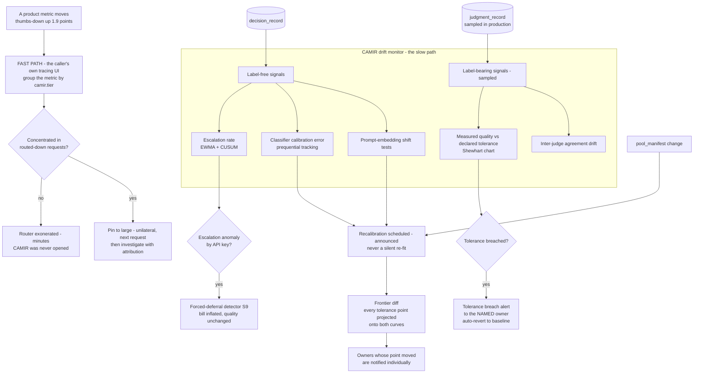

# D08 — Observability, drift and the breach path: how a quality question becomes an attributed answer

**What this is** — the monitoring architecture: what is watched, on what signal, with what detector, and the two paths a quality signal can take — the fast path in the caller's own telemetry, and the slow path through CAMIR's drift monitor into a recalibration.
**Why it exists** — the deployment does not die from a bad routing decision. It dies from an *unattributable* one: a product metric moves in month four, nobody can say whether the router caused it, and the safe response — pin everything to the large tier — is also the permanent one. Metric M13 puts a number on the survival condition (question to attributed answer, under one hour), and this diagram is where that number is either mechanised or wished for. It also carries the detector for the one attack that looks exactly like success: forced deferral, which inflates the bill without degrading a single answer [S9].
**How to read it** — the fast path is the left branch and it does not touch CAMIR. That is the point. A skeptic should attack the label-free detectors: the drift monitor mostly watches signals that do not require a judge, and whether that is sufficient is untested.
**Depends on / feeds** — depends on [D03.md](D03.md), [D04.md](D04.md), [../deep_dives.md](../deep_dives.md) DD7; feeds [D10.md](D10.md), [../../product/journeys/day_in_life.md](../../product/journeys/day_in_life.md), [../../validation/metrics_by_stage.md](../../validation/metrics_by_stage.md) and [../../financials/risk_matrix.md](../../financials/risk_matrix.md).

---

---

## What a reviewer should notice

1. **The fast path does not enter CAMIR.** The question that decides the deployment's survival is answered by grouping the caller's own metric by a span attribute, in the caller's own tool. CAMIR's contribution to that path was written four months earlier by the trace stamper and would survive CAMIR being uninstalled (O2). **Any design that routes this question through a CAMIR dashboard has moved the veto-holder's answer into a surface he will never open.**
2. **The exoneration branch is the common case and it is drawn first.** In [../../product/journeys/day_in_life.md](../../product/journeys/day_in_life.md) the regression is concentrated in requests that went to the *large* tier — the ones CAMIR did not route down. A monitoring architecture that can only detect CAMIR's own faults cannot produce that answer, and the answer it cannot produce is the one that saves the deployment.
3. **Pinning is on the fast path, before investigation.** The order is deliberate: exit first, diagnose second. A person who cannot exit does not investigate, they escalate.
4. **Most detectors are label-free.** Production judging is sampled, so escalation rate, calibration error and embedding shift carry the monitoring load, with measured quality confirmed on a sample. **This is a real limitation**: a quality regression invisible in all three label-free signals is detected only at the next sample. The mitigation is the fast path and the conservative default tolerance, not a claim of complete coverage.
5. **The tolerance breach alert goes to the named owner, not to the platform team.** `tolerance_policy.owner` is non-null (O3, [D04.md](D04.md)), so the alert has an addressee by construction. Auto-revert is on by default: a quality drop with no alert is a **P0 defect class** (O4), not a missed feature.
6. **Recalibration is scheduled and announced, never silent.** The frontier diff projects every tolerance point onto both curves, and owners whose point moved are notified individually. A router that quietly re-fits under a signed policy is the vendor-set tolerance that produced the public GPT-5 routing backlash [S21], with better branding.
7. **The escalation-rate anomaly detector is a security control in economic clothing.** Semantics-preserving perturbations can suppress small-tier confidence and force escalation [S9]. Nothing looks broken; quality is fine; the bill is being attacked. It ships **with** the confidence gate, because PR1 makes first-stage resolution the variable that sets cascade cost — and therefore the variable an adversary attacks.

---

## Detectors, signals and what each catches

| Signal | Detector | Label needed | Catches | Misses |
|---|---|---|---|---|
| Escalation rate | EWMA + CUSUM (W3-36, W3-35) | no | Cascade economics inverting; forced deferral [S9] | Quality drops with stable escalation |
| Classifier calibration error | Prequential accuracy (W2-46) | sampled | Classifier decay after traffic shift | Gate drift, which is separate |
| Prompt-embedding distribution | Shift tests (W2-44) | no | New traffic mix, new endpoint behaviour | Same-distribution quality change |
| Measured quality vs tolerance | Shewhart chart (W3-34) | yes | The breach that matters | Anything between samples |
| Inter-judge agreement | Trended (W2-31) | yes | Judge drift making the whole frontier untrustworthy | — |
| `pool_manifest` version | Exact match (W2-47) | no | A model upgrade invalidating the frontier by definition [S29] | — |

**Run rules for alert suppression** (W3-37) sit over all of it. An owner who mutes alerts is a dead deployment, so the false-positive budget is a product decision, not a tuning detail.

---

## The two clocks

| | Fast path | Slow path |
|---|---|---|
| Question | *"Was it the router?"* | *"Is the frontier this policy was signed against still true?"* |
| Owner | The consuming engineer | The tolerance owner and the platform team |
| Tool | Their own tracing UI | CAMIR |
| Target | **Under one hour** (M13); four minutes in the worked case | Days to weeks |
| Failure if slow | The deployment is pinned permanently | The policy drifts toward a stale curve |

---

## Recommended next 3

1. **Rehearse the fast path with a design partner's consuming engineer, with CAMIR's control plane switched off.** If he cannot answer "was it the router?" from his own tooling under time pressure, the four P0 features are insufficient and [../../validation/riskiest_assumptions.md](../../validation/riskiest_assumptions.md) has a new top row — and this is testable before any routing is enforced.
2. **Ship the forced-deferral detector in the same release as the confidence gate.** The attack looks exactly like organic traffic growth, so a gate shipped without it means the first incident is discovered on an invoice, weeks later, by the person least able to explain it.
3. **Publish the false-positive rate of the breach alert as a product metric.** Alert fatigue is how monitoring dies, and an owner who mutes the tolerance alert has silently converted CAMIR back into an unattributable router — the exact state this diagram exists to prevent.
