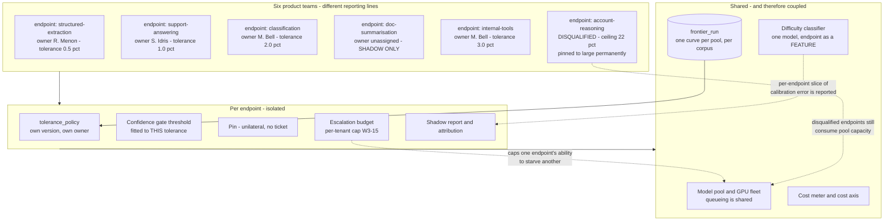

# D09 — Multi-endpoint scale and isolation: how six teams share one router without sharing one tolerance

**What this is** — the isolation architecture: the endpoint as the unit of policy, blast radius, attribution and pinning; how six product teams share one shared inference service and one model pool while owning six independent quality tolerances; and what is genuinely shared and therefore genuinely coupled.
**Why it exists** — CAMIR is deployed by a platform team into an organisation where the platform team owns the *service* and other teams own the *features*. If the isolation unit is the deployment, then one tolerance governs six teams, the strictest team sets it for everybody, and the router converges on "always use the large tier" — which is endpoint-level static assignment, one of the four workarounds CAMIR exists to replace. If the isolation unit is the endpoint, six teams can hold six different risk appetites over one pool. **The choice of isolation unit is the difference between a product and a config file**, and it is not recoverable later.
**How to read it** — look for what is shared: the pool, the frontier, the classifier. Those three are the coupling, and each is a place one team's behaviour can reach another's. A skeptic should attack the shared classifier.
**Depends on / feeds** — depends on [D03.md](D03.md), [D04.md](D04.md), [D06.md](D06.md); feeds [D10.md](D10.md), [../../product/journeys/beachhead.md](../../product/journeys/beachhead.md) and [../../strategy/sales_roadmap.md](../../strategy/sales_roadmap.md).

**Multi-*endpoint*, not multi-*customer*.** N4 forbids multi-tenant SaaS; the control plane runs in one customer's VPC. Nothing here describes two companies sharing anything.

---

---

## What a reviewer should notice

1. **The endpoint is the isolation unit for policy, pinning, attribution and blast radius.** Six tolerances, six owners, six thresholds, six shadow reports. The strictest team does not set the tolerance for everyone, which is the failure that collapses routing back into static assignment.
2. **`doc-summarisation` has no owner and is therefore shadow-only.** Enforcement requires a named `tolerance_policy.owner` (O3, [D04.md](D04.md)), so an unowned endpoint is not blocked by a policy document — it is blocked by a `NOT NULL` constraint. The default when nobody has accepted the risk is *do not route*.
3. **`account-reasoning` is disqualified and stays on the diagram.** CAMIR removed the customer's most expensive endpoint from its own scope in week one and it still consumes pool capacity. Drawing it is the honest version: disqualification is a permanent state of an endpoint, not a temporary state of a sales cycle.
4. **Three things are genuinely shared, and each is a coupling.** The **pool** couples through queueing — a burst on one endpoint slows another, which is why per-tenant escalation budgets (W3-15) exist as a cap. The **frontier** is per pool and per corpus, so a pool upgrade moves every endpoint's curve at once and every owner is notified ([D08.md](D08.md)). The **classifier** is one model with endpoint as a feature.
5. **The shared classifier is the weakest isolation claim on the page.** One model trained on all endpoints' labels means a large, noisy endpoint can degrade prediction quality for a small, well-behaved one. The mitigation — per-endpoint calibration error reported separately, so degradation is visible per owner rather than averaged away — detects the problem rather than preventing it. Per-endpoint models are the alternative and they fragment the training data that makes the classifier work at all. **This is an unresolved trade and it is stated as one.**
6. **Escalation budgets cap the blast radius of both an attack and a mistake.** The forced-deferral attack [S9] and a misconfigured batch retry look identical from the pool's side; a per-endpoint cap limits what either can do to everyone else's latency and bill.
7. **The cost meter is shared, deliberately.** One derivation prices every endpoint, so six teams' savings numbers are denominated identically and can be summed into Dana's one page without a reconciliation step.

---

## Scale: what grows with what

| Dimension | Grows with | Cost | Note |
|---|---|---|---|
| `tolerance_policy` rows | endpoints × policy revisions | trivial | Append-only, permanent |
| Gate thresholds | endpoints | trivial | Each fitted to its own tolerance |
| Calibration sets | endpoints × label rate | moderate | A small endpoint may never reach the minimum count to fit its own threshold — it inherits the deployment default and is **labelled as inheriting**, not silently defaulted |
| Ceiling probe cost | corpus × tiers | **dominant** | Per pool, not per endpoint — the one cost that does not multiply by teams |
| Shadow mode cost | endpoints in shadow × traffic | real | Shadow generates twice; a deployment with six endpoints in permanent shadow is paying for evidence it is not using |
| Judging cost | sampled production rate | moderate | The lever most likely to be cut, and the one that starves loop 1 |

---

## Failure isolation

| Failure | Blast radius | Why |
|---|---|---|
| One endpoint's threshold badly fitted | That endpoint | Thresholds are per endpoint and per tolerance |
| One endpoint pinned to large | That endpoint, plus pool capacity | Visible on the pin-to-large rate (M11) as a product failure |
| Classifier degrades | **All endpoints** | The shared component; per-endpoint calibration error is the detector |
| Pool tier removed or upgraded | **All endpoints** | Frontier re-run, every point projected, every owner notified |
| Forced-deferral attack on one key | Capped by escalation budget | W3-15, W3-16 |
| Control plane down | None on the request path | Fail open to baseline, stamped `route=fallback` ([D03.md](D03.md)) |

---

## Recommended next 3

1. **Fix the endpoint as the isolation unit in the first schema, and never allow a deployment-wide tolerance override.** A global tolerance is the obvious convenience for the platform team and it destroys the organisational property that makes CAMIR deployable — once one exists, the strictest consumer sets it and the router converges on the large tier.
2. **Report per-endpoint classifier calibration error from the first release.** It is the only detector for the shared-classifier coupling, it is cheap, and without it a small team's quality degrades inside an average that looks fine.
3. **Cap and surface shadow-mode cost per endpoint.** Shadow generates twice, and an organisation that leaves six endpoints in permanent shadow is paying a routing premium to run no routing — which is a defensible choice, but only if someone can see they are making it.
