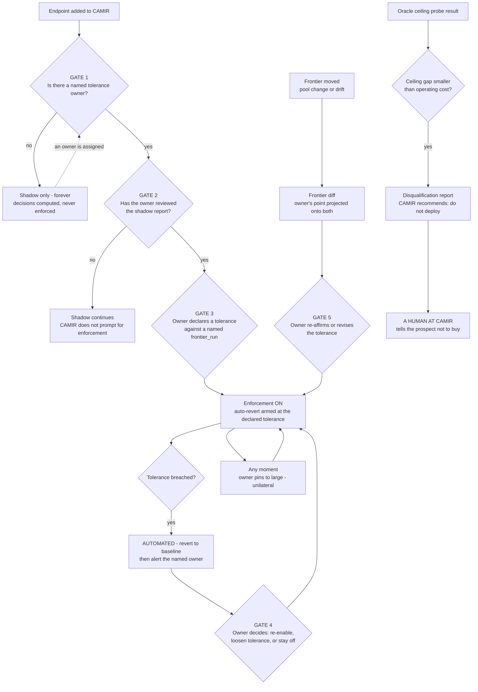

# D10 — Human-in-the-loop and escalation: where a person is required, not merely permitted

**What this is** — the map of the five points where CAMIR stops and requires a human decision, who that human is by role, what the system does while it waits, and the one escalation path that runs *out* of the product into the organisation.
**Why it exists** — routing is an automation that spends someone else's quality budget. The public record of what happens when the tolerance is set by the vendor rather than the customer is the GPT-5 routing backlash: complex queries degraded by being sent to a smaller model, with no dial and no attribution [S21]. Every human gate on this page is a deliberate refusal to automate a decision CAMIR is technically capable of making — and each one is a decision a competitor optimising for frictionless onboarding would remove. **This diagram is the record of which frictions are load-bearing**, so that a future roadmap under conversion pressure cannot delete one by accident.
**How to read it** — the five gates are ranked by what removing them would cost. Gate 1 is the one that cannot be removed at any price. A skeptic should attack Gate 5: telling a prospect not to buy is a strategy only if the disqualification rate is genuinely non-zero.
**Depends on / feeds** — depends on [D08.md](D08.md), [D09.md](D09.md), [../../product/PRD.md](../../product/PRD.md) §7; feeds [../../validation/decision_making_unit.md](../../validation/decision_making_unit.md), [../../product/ux_spec.md](../../product/ux_spec.md) and [../../narrative/one_pager.md](../../narrative/one_pager.md).

---

---

## The five gates, ranked by the cost of removing them

| # | Gate | The human | Automating it would... | Removable? |
|---|---|---|---|---|
| **1** | No enforcement without a named tolerance owner | The consuming team's engineer | ...restore the exact structure of the GPT-5 backlash: quality spent by a party who did not accept the risk [S21] | **Never.** It is a `NOT NULL` constraint, not a policy |
| **2** | No enforcement without the owner reading a shadow report | Same person | ...make enforcement a default rather than a decision, which is what makes it revocable in anger | No |
| **3** | The tolerance is declared against a *named* `frontier_run` | Same person | ...let a policy float free of the measurement it was chosen on, so nobody could ever tell whether their point moved | No |
| **4** | After an auto-revert, a human decides what happens next | Same person | ...create an oscillating router: revert, re-enable, revert. Automation reverts; only a human re-enables | No |
| **5** | A frontier that moved requires re-affirmation | Same person | ...be a silent re-fit under a signed policy — the single behaviour that most resembles the incumbent failure | Softenable: re-affirmation can be an acknowledgement rather than a re-declaration |

**Auto-revert is the one thing CAMIR automates in the risky direction, and it only ever moves toward safety.** The system may unilaterally stop routing; it may never unilaterally start.

---

## What a reviewer should notice

1. **`SHADOW → forever` is a terminal state, not a funnel stage.** An endpoint with no owner runs in shadow indefinitely and CAMIR **does not prompt for enforcement** (Gate 2's `WAIT` branch). A nag here would be the obvious conversion optimisation and it would convert the owner's decision into a dismissed dialog.
2. **The pin loop attaches to the enforcement state at any moment** and returns to it. Pinning is not an incident, not an escalation and not a support ticket; it is a normal transition available to one person, always ([../../product/ux_spec.md](../../product/ux_spec.md) S10).
3. **Auto-revert acts first and alerts second.** A quality drop with no alert is a P0 defect class (O4). Reverting before notifying is the correct order, because the alert's value is in explaining what already stopped.
4. **The disqualification path ends at a human at CAMIR, not at a report.** A generated PDF saying *do not deploy* is a feature; a person on a call saying it is a strategy — and it is the one no vendor billing a share of the customer's bill can execute [S17][S20]. M16 requires the disqualification rate to be **non-zero**: a zero rate means the ceiling probe is not being believed, either by CAMIR or by the prospect.
5. **All five gates fall on the same person** — the endpoint's tolerance owner, who in the beachhead is a product engineer in a different reporting line from the buyer. The economic buyer appears nowhere on this diagram. That is the structural fact the whole product is arranged around: **the person who signs and the person who consents are different people, and only one of them is in the sales conversation.**
6. **No gate asks the platform team for permission.** Marcus deploys CAMIR; he does not authorise enforcement on someone else's endpoint. A design where the platform team could would be simpler, faster to sell, and would reproduce the failure this pack is built to avoid.

---

## What CAMIR does while it waits

| Waiting on | Behaviour | Why not just proceed |
|---|---|---|
| An owner to be named | Shadow: decisions computed, logged, attributed; **traffic untouched** | The evidence accumulates at no risk, so the eventual decision is cheap to make and expensive to regret |
| A shadow report to be read | Nothing changes; no reminder is sent | A reminder is a nag, and a nag turns a consent into a dismissal |
| A post-revert decision | Baseline serves all traffic | The expensive direction is the safe one |
| Re-affirmation after a frontier move | Enforcement continues **at the old tolerance** with the endpoint banded stale | Stopping traffic because a curve moved would make every model upgrade an outage |

The last row is the only place CAMIR keeps enforcing under a policy whose basis has changed, and it is a deliberate trade against availability. It is the weakest of the five gates and the one most worth revisiting with real deployment evidence.

---

## Recommended next 3

1. **Write these five gates into the product's acceptance tests, with the reason attached.** Each is friction a future roadmap under conversion pressure will propose removing, and each will look like a small onboarding win. A test that fails with *"enforcement without a named owner reproduces [S21]"* is the only version of this document that survives contact with a growth target.
2. **Staff Gate 5's disqualification conversation before the first ten prospects, and track the rate.** It is a person telling a qualified-looking prospect not to buy, which no sales process does by default. M16 says the rate should be non-zero; if it comes back zero across the first ten, the ceiling probe is not being believed and [../../strategy/positioning.md](../../strategy/positioning.md) is resting on a claim nobody has acted on.
3. **Test the stale-frontier trade with the first design partner.** Continuing to enforce at a tolerance whose curve has moved is the weakest gate on this page; whether owners find that acceptable or alarming is a question one conversation answers and no amount of design will.
