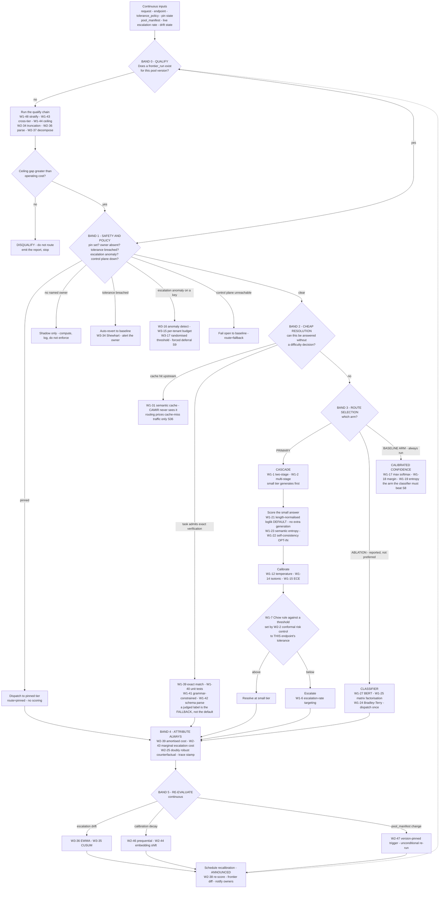

# CAMIR — Technique decision tree: what fires, when, and in what order

**What this is** — the runtime logic that selects among the 139 techniques catalogued in waves 1–3: which sensing inputs are read, which safety and policy states short-circuit everything else, which branch a request takes, and what triggers re-evaluation. A Mermaid flowchart plus the logic table it compresses.
**Why it exists** — a catalogue of 139 techniques is an arsenal, not a system, and the failure mode of an arsenal is that everything looks applicable. Worse, the ordering here encodes two commitments that a straightforward implementation gets backwards: **policy and pin are read before any difficulty signal**, and **the disqualification check runs before any routing exists at all**. A decision tree that starts with "estimate difficulty" is a router; this one starts with "is routing permitted here, and is it worth doing", which is the product.
**How to read it** — read the four priority bands top to bottom; the first band that matches wins and nothing below it runs. A skeptic should attack Band 3's default: CAMIR chooses the cascade over the classifier as the primary route on the strength of [S8] and [S4], and that choice determines most of the system's economics.
**Depends on / feeds** — depends on [wave1.md](wave1.md), [wave2.md](wave2.md), [wave3.md](wave3.md), [../deep_dives.md](../deep_dives.md), [../architecture/D03.md](../architecture/D03.md); feeds [technique_feature_matrix.md](technique_feature_matrix.md), [../not_vaporware.md](../not_vaporware.md) and [../../product/features_prioritized.md](../../product/features_prioritized.md).

---

---

## The logic table

| Band | Condition | Techniques that fire | Everything below is skipped because |
|---|---|---|---|
| **0** | No `frontier_run` for this pool version | W1-43, W1-44, W1-45, W1-47, W1-48, W2-34, W2-36, W2-37, W2-38 | Routing without a measured ceiling is a promise. **This band can terminate the whole system** with a disqualification (PR7) |
| **1** | Pin set | none — dispatch directly | A pin is an owned decision, not an input to a model. Scoring a pinned request would make the pin advisory |
| **1** | No named tolerance owner | shadow computation only | Enforcement without an accepted risk reproduces the structure of the GPT-5 backlash [S21] (O3) |
| **1** | Tolerance breached | W3-34, W3-37, auto-revert | A quality drop with no alert is a P0 defect class (O4) |
| **1** | Escalation anomaly on a key | W3-14, W3-15, W3-16, W3-17 | Forced deferral inflates the bill while quality looks perfect [S9]. It must be caught before it is priced (O5) |
| **1** | Control plane unreachable | fail open, `route=fallback` | CAMIR is never on the customer's uptime critical path (N2) |
| **2** | Task admits programmatic verification | W1-39, W1-40, W1-41, W1-42 | The cheapest way to raise judge reliability is to need the judge less often [S33] |
| **2** | Cache hit upstream | W1-31 (upstream, not CAMIR's) | Caching is orthogonal and takes 20–45% of traffic first [S36]; CAMIR prices the residual only (N3) |
| **3** | Default | W1-1/W1-2 cascade + W1-21 → W1-12 → W1-7 → W2-2 | **Cascade is primary.** The classifier is the ablation and calibrated confidence is the arm it must beat [S8] |
| **3** | Ablation arm, always reported | W1-24, W1-25, W1-26, W1-27, W2-7 | Reported against calibrated confidence, never against a fixed model (PR3). Expected result: null-ish [S4] |
| **4** | Always | W2-39, W2-41, W2-42, W2-43, W2-22, W2-25, W3-31, W3-32 | Attribution is unconditional. An unattributable decision is the failure that kills deployments |
| **5** | Continuous | W2-44, W2-45, W2-46, W2-47, W3-34, W3-35, W3-36, W3-37 | The frontier is a dated measurement that decays [S29]. Detection is automatic; **action is announced** |

---

## What the ordering commits to

1. **Band 0 before everything.** The disqualification check precedes the router's existence. Most routing systems have no equivalent band because their revenue depends on the answer being yes.
2. **Band 1 before any difficulty signal.** Pin, ownership and breach are read first, unconditionally. Reading the pin lazily is an obvious latency optimisation and a product-fatal one ([../architecture/D03.md](../architecture/D03.md)).
3. **Band 2 before Band 3.** Exact verification beats a judged label, and a cache hit beats a routing decision. Both reduce the number of places CAMIR's own machinery has to be right.
4. **Band 3's default is the cascade, and the classifier never runs alone.** Calibrated confidence is always computed as the comparison arm. The system is built so that its least reliable component is also its most measurable one.
5. **Band 4 is unconditional.** Every path — pinned, cached, verified, cascaded, classified, failed-open — arrives at attribution.
6. **Band 5 loops back to Band 0.** A pool change re-opens the qualify question, including the disqualification branch. A customer who qualified last quarter can stop qualifying, and CAMIR is built to notice.

---

## Techniques that deliberately never fire at runtime

- **W1-32 prompt-length thresholding** and **W1-33 keyword/regex rules** — catalogued in wave 1 as *documented failures*. They are the workarounds CAMIR replaces, and length is not a difficulty proxy on real traffic ([../../product/journeys/edge_high.md](../../product/journeys/edge_high.md)).
- **W1-34 endpoint-level static assignment** — the incumbent workaround; it appears only as the fixed-model baseline.
- **W3-10 to W3-13 speculative decoding** — an implicit cascade *inside* the serving engine, not a CAMIR decision. It changes the cost of a tier, not the choice of one, and CAMIR reads its acceptance-rate telemetry as a difficulty signal rather than controlling it.
- **W3-19 to W3-21 latency-aware routing** — non-goal N6; a third axis triples the frontier's dimensionality before the two-dimensional one has been measured once [S12].

---

## Recommended next 3

1. **Implement Bands 0 and 1 before Band 3.** They are the bands that make routing *permitted*, and they are the two an implementation naturally builds last because they are not the interesting part. A router shipped with Band 3 and without Band 1 is the product that gets pinned to large in month four.
2. **Assert the band ordering in a conformance test.** Each band is a plausible optimisation target — skip the pin read, skip the ownership check on a hot path, cache the tolerance too aggressively — and each shortcut is invisible in benchmarks and fatal in deployment.
3. **Report the Band 3 ablation publicly, including when it is null.** [S4] predicts the classifier gains little over calibrated confidence. Publishing that result is worth more than winning it: it is the evidence that CAMIR's numbers are measurements rather than marketing, and it is the thing [../../product/journeys/edge_high.md](../../product/journeys/edge_high.md) turns on.
